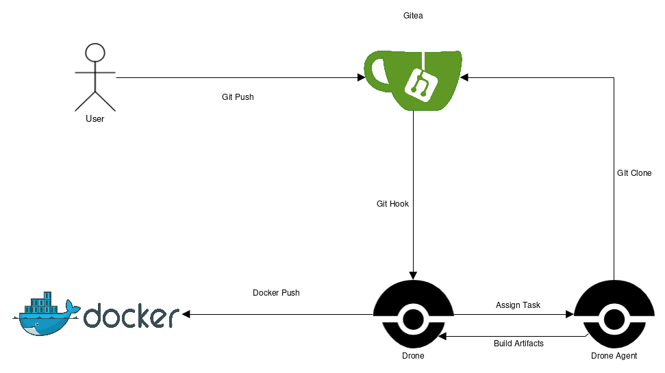

# Continous Integration / Continuous Delivery mit Gitea und Drone

Dieses Repository stellt einen Teil der Abgabe für die Projektarbeit im Kurs "Servicemanagement in Netzen" im WS18/19 dar. Es implementiert ein Continous Integration- und Continous Delivery-System, das sich über Vagrant und Docker Compose mit einzigen Kommando starten lässt.

Der zweite Teil des Projekts ist ein [Kommandozeilenprogramm mit Tests und einer Drone-Pipeline](https://github.com/svcmgmt1819-mhdw/ci-test), das verwendet wird, um die Funktionalität zu demonstrieren.

## Architektur



Das Projekt besteht aus den folgenden Komponenten:

- [Gitea Git-Server](https://gitea.io): Ein Git-Server mit einer Oberfläche ähnlich zu GitHub. Gitea ist kompatibel mit Drone und informiert den CI-/CD-Server über Änderungen am Repository.
- [Drone CI-/CD-Server](https://drone.io): API-Server, der die Build-Aktivitäten verwaltet. Er bietet zusätzlich ein Webinterface, um die einzelnen Build-Vorgänge einzusehen und zu konfigurieren. Die [Build-Pipeline](https://docs.drone.io/user-guide/pipeline/) wird über eine Datei namens `.drone.yml` innerhalb des Projekt-Repositorys konfiguriert.
- Drone Agent: Diese Komponente ist verantwortlich für einen konkreten Build-Vorgang.

## Installation

Nach dem Klonen des Repositorys kann das System über den Befehl

```
vagrant up
```

hochgefahren werden. Bei der Ersteinrichtung des Gitea-Servers ist darauf zu achten, die IP-Adressen, unter denen der Git-Server erreichbar ist so zu wählen, dass auch der Drone-Server Gitea über diese erreichen kann. Konkret bedeutet dies, dass die Basisadresse als `10.130.1.100` anzugeben ist.

Gitea muss vor der ersten Verwendung des Drone-Servers konfiguriert werden. Hierbei ist zu beachten, dass im Installationsassistenten die Zieladressen angegeben werden, unter der der Gitea-Server "von außen" erreichbar sein wird (im Testsystem `10.130.1.100`).

## Verwendung

Die über Vagrant gestartete Maschine erhält die IP-Adresse `10.130.1.100`. Die folgenden Services sind erreichbar:

- Gitea Git-Server ist erreichbar über Port 3000/HTTP und 2222/SSH.
- Drone API-Server auf Port 8000/HTTP.
- pgAdmin 4 als Oberfläche zur Verwaltung der Datenbank auf Port 8001/HTTP. Standardusername und Passwort sind `admin`/`Password1`. Innerhalb des pgAdmin-Containers ist die Datenbank über den Hostnamen `db` zu erreichen mit Username/Passwort/Datenbank `gitea`.

Bevor Docker-Images auf Docker Hub veröffentlicht werden können, müssen im Drone Webinterface unter `Secrets` die Zugangsdaten hinterlegt werden. Dies geschieht über die Eintragung der Variablen `docker_username` und `docker_password`.